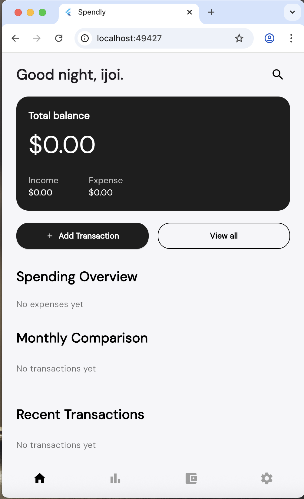
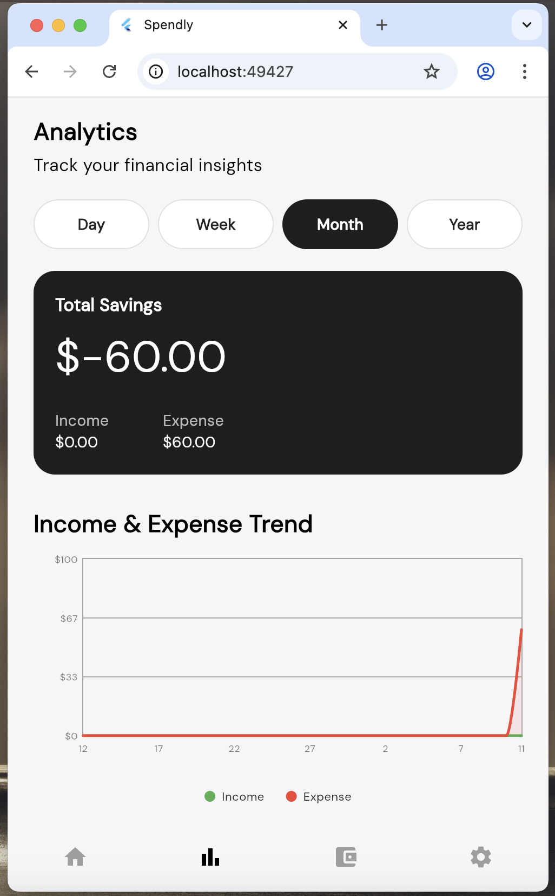
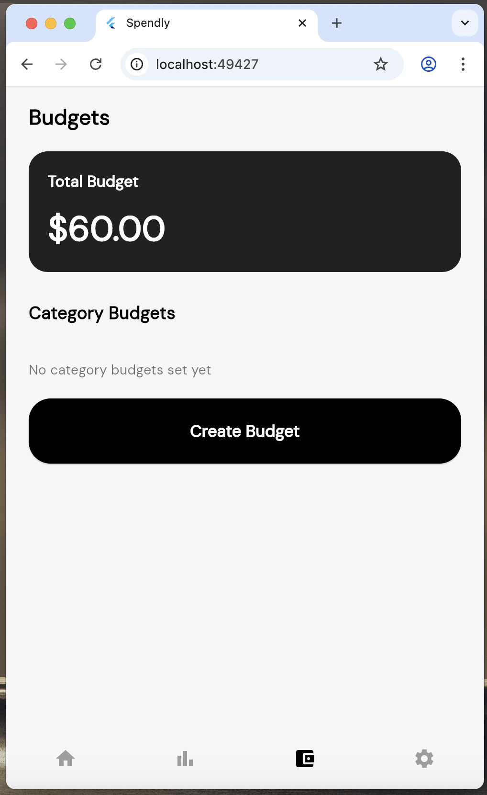
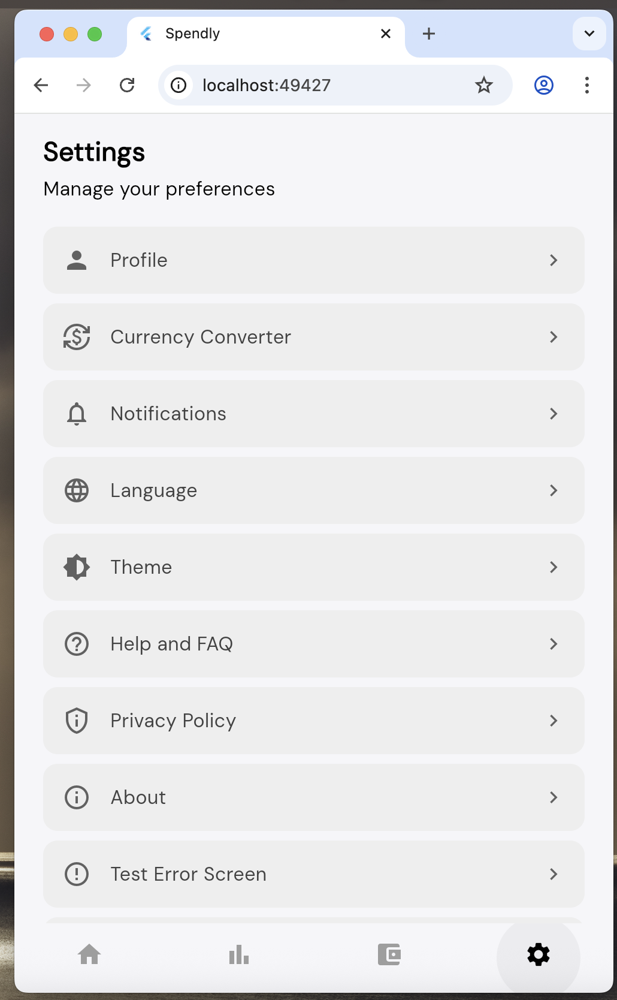

# FinTrack App (Spendly)

<div align="center">


**A comprehensive personal finance management application built with Flutter**

[Features](#features) • [Installation](#installation) • [Usage](#usage) • [Project Structure](#project-structure) • [Contributing](#contributing)

</div>

---

## Overview

FinTrack App (also known as **Spendly**) is a modern, cross-platform personal finance management application designed to help users track their income, expenses, budgets, and financial analytics. Built with Flutter, the app provides a beautiful, intuitive interface with support for multiple currencies, languages, and themes.

The application offers comprehensive financial tracking capabilities including transaction management, budget planning, spending analytics, and multi-currency support with real-time exchange rates. With a focus on user experience, the app features dark mode, customizable text scaling, and full localization support for English, Russian, and Kazakh languages.

## Screenshots

<div align="center">
  <table>
    <tr>
      <td align="center" width="50%">
        
        <br/>
        <sub style="font-size: 14px; color: #666;"><b>Home Screen</b></sub>
      </td>
      <td align="center" width="50%">
        
        <br/>
        <sub style="font-size: 14px; color: #666;"><b>Analytics</b></sub>
      </td>
    </tr>
    <tr>
      <td align="center" width="50%">
        
        <br/>
        <sub style="font-size: 14px; color: #666;"><b>Budget</b></sub>
      </td>
      <td align="center" width="50%">
        
        <br/>
        <sub style="font-size: 14px; color: #666;"><b>Settings</b></sub>
      </td>
    </tr>
  </table>
</div>

## Features

### 💰 Core Financial Management
- **Transaction Tracking**: Add, edit, and delete income and expense transactions
- **Multi-Currency Support**: Track transactions in USD, EUR, and KZT with automatic currency conversion
- **Real-Time Exchange Rates**: Automatic currency conversion using live exchange rate API
- **Transaction Categories**: Organize transactions by categories (Food, Transport, Shopping, etc.)
- **Payment Methods**: Track payment methods for each transaction
- **Transaction Search**: Powerful search functionality across all transaction fields

### 📊 Analytics & Insights
- **Spending Overview**: Visual breakdown of spending by category
- **Income vs Expense Trends**: Interactive charts showing financial trends over time
- **Time Period Analysis**: View analytics for different time periods (Week, Month, Year)
- **Category Breakdown**: Detailed spending analysis by category with pie charts
- **Monthly Comparison**: Compare spending across different months

### 💳 Budget Management
- **Total Budget**: Set and track overall monthly budgets
- **Category Budgets**: Create budgets for specific spending categories
- **Budget Progress Tracking**: Visual indicators showing budget usage and remaining amounts
- **Budget Warnings**: Alerts when approaching or exceeding budget limits
- **Multi-Currency Budgets**: Support budgets in different currencies with automatic conversion

### 🏦 Card & Account Management
- **Multiple Cards**: Add and manage multiple bank cards and accounts
- **Card Types**: Support for Debit Cards, Credit Cards, Savings Accounts, and Checking Accounts
- **Balance Tracking**: Track balances across different accounts
- **Card Customization**: Custom card names and bank associations

### 🎨 User Experience
- **Dark Mode**: Beautiful dark theme with smooth transitions
- **Light Mode**: Clean, modern light theme
- **Text Scaling**: Adjustable text size (0.8x to 1.4x) for accessibility
- **Responsive Design**: Optimized for various screen sizes
- **Smooth Animations**: Polished UI with smooth transitions and animations

### 🌍 Localization
- **Multi-Language Support**: English (en), Russian (ru), Kazakh (kk)
- **Dynamic Language Switching**: Change language on-the-fly without app restart
- **Localized Content**: All UI elements, categories, and messages are fully localized

### ⚙️ Settings & Preferences
- **Profile Management**: Edit user profile information
- **Notification Settings**: Customize push notifications, email alerts, and SMS notifications
- **Theme Customization**: Switch between light and dark themes
- **Currency Preferences**: Set default currency for transactions
- **Help & FAQ**: Comprehensive help section with frequently asked questions
- **Privacy Policy**: Built-in privacy policy page
- **About Page**: Application information and version details

### 🔔 Notifications
- **Transaction Alerts**: Get notified about important transactions
- **Budget Warnings**: Alerts when approaching budget limits
- **Savings Goals**: Track and get notified about savings milestones
- **Monthly Reports**: Automated monthly financial summaries
- **Bill Reminders**: Never miss a bill payment
- **Do Not Disturb**: Configure quiet hours for notifications

## Installation

### Prerequisites

Before you begin, ensure you have the following installed:
- **Flutter SDK** (version 3.10.3 or higher)
- **Dart SDK** (comes with Flutter)
- **Android Studio** or **VS Code** with Flutter extensions
- **Xcode** (for iOS development on macOS)
- **Git**

### Step 1: Clone the Repository

```bash
git clone https://github.com/your-username/fintrack-app.git
cd fintrack-app
```

### Step 2: Install Dependencies

```bash
flutter pub get
```

### Step 3: Run the Application

#### For Android:
```bash
flutter run
```

#### For iOS:
```bash
flutter run
```

#### For Web:
```bash
flutter run -d chrome
```

#### For Desktop (Windows/Linux/macOS):
```bash
flutter run -d windows  # or linux, macos
```

### Step 4: Build for Production

#### Android APK:
```bash
flutter build apk --release
```

#### Android App Bundle:
```bash
flutter build appbundle --release
```

#### iOS:
```bash
flutter build ios --release
```

## Usage

### Getting Started

1. **Launch the App**: Open the FinTrack app on your device
2. **Onboarding**: Complete the welcome screens to get familiar with the app
3. **Create Profile**: Set up your user profile with your name and preferences
4. **Add Cards**: Add your bank cards or accounts to track balances
5. **Start Tracking**: Begin adding transactions to track your income and expenses

### Adding Transactions

1. Navigate to the **Home** screen
2. Tap the **"+"** button or "Add Transaction" option
3. Fill in the transaction details:
   - Title (e.g., "Grocery Shopping")
   - Category (Food, Transport, Shopping, etc.)
   - Amount
   - Date
   - Transaction type (Income or Expense)
   - Currency
   - Payment method (optional)
   - Description (optional)
4. Tap **Save** to add the transaction

### Setting Up Budgets

1. Navigate to the **Budget** screen
2. Tap on the **Total Budget** card to set your overall monthly budget
3. Tap **"Create Budget"** to add category-specific budgets
4. Select a category and set the budget limit
5. The app will track your spending against these budgets

### Viewing Analytics

1. Navigate to the **Analytics** screen
2. Select a time period (Week, Month, or Year)
3. View your spending breakdown by category
4. Analyze income vs expense trends
5. Review category-wise spending patterns

### Managing Settings

1. Navigate to the **Settings** screen
2. Access various settings:
   - **Profile**: Edit your profile information
   - **Currency**: Set default currency
   - **Language**: Change app language
   - **Theme**: Switch between light and dark modes
   - **Notifications**: Configure notification preferences
   - **Help & FAQ**: Get help and answers to common questions

## Project Structure

```
fintrack-app/
├── android/                 # Android platform-specific files
├── ios/                     # iOS platform-specific files
├── lib/                     # Main application code
│   ├── components/          # Reusable UI components
│   │   ├── arrow/          # Navigation arrows
│   │   ├── button/         # Button components
│   │   ├── cards/          # Card components
│   │   ├── charts/         # Chart components
│   │   ├── error/          # Error handling components
│   │   ├── fields/         # Input field components
│   │   ├── modal/          # Modal components
│   │   ├── nav/            # Navigation components
│   │   ├── search/         # Search components
│   │   ├── toggle/         # Toggle components
│   │   └── transaction/    # Transaction-related components
│   ├── models/             # Data models
│   │   ├── budget_model.dart
│   │   ├── card_model.dart
│   │   └── transaction_model.dart
│   ├── screens/            # Application screens
│   │   ├── analytics/      # Analytics screen and widgets
│   │   ├── auth/           # Authentication screens
│   │   ├── budget/         # Budget management screens
│   │   ├── error/          # Error screens
│   │   ├── home/           # Home screen and widgets
│   │   ├── onboarding/     # Onboarding screens
│   │   ├── search/         # Search screens
│   │   └── settings/       # Settings screens and pages
│   ├── services/           # Business logic services
│   │   ├── budget_service.dart
│   │   ├── card_service.dart
│   │   ├── connectivity_service.dart
│   │   ├── currency_conversion_service.dart
│   │   ├── language_service.dart
│   │   ├── transaction_service.dart
│   │   └── user_service.dart
│   ├── utils/              # Utility functions and helpers
│   │   ├── analytics_calculator.dart
│   │   ├── app_localizations.dart
│   │   ├── category_colors.dart
│   │   ├── currency.dart
│   │   ├── modal_helper.dart
│   │   ├── responsive.dart
│   │   ├── smooth_modal_route.dart
│   │   ├── spending_calculator.dart
│   │   └── validation_helper.dart
│   ├── app_settings.dart   # App-wide settings
│   └── main.dart           # Application entry point
├── assets/                 # Images and other assets
├── pubspec.yaml           # Flutter dependencies and configuration
└── README.md              # This file
```

### Key Components

- **Services**: Singleton services managing app state (transactions, budgets, cards, etc.)
- **Models**: Data models representing transactions, budgets, and cards
- **Screens**: Main application screens organized by feature
- **Components**: Reusable UI components used across the app
- **Utils**: Helper functions for calculations, formatting, and localization

## Branch Overview

The repository contains several branches with different features and improvements:

### `main`
The primary production branch containing the latest stable version of the application with all merged features.

**Key Features:**
- Complete transaction management system
- Budget tracking and management
- Analytics with charts and visualizations
- Multi-currency support
- Settings and preferences
- Dark/light theme support
- Multi-language localization

### `converter_and_locator`
Branch focused on currency conversion and location-based features.

**Features:**
- Enhanced currency conversion functionality
- Location-based services integration
- Geolocator and geocoding support

### `fix/ui-features`
Branch containing UI improvements and feature enhancements.

**Features:**
- Overall UI improvements
- Enhanced user experience
- Code refactoring and formatting
- Improved component modularity

### `notifications-faq-theme`
Branch with notifications, FAQ, and theme enhancements.

**Features:**
- Comprehensive notification system
- Help & FAQ page implementation
- Theme customization improvements
- About and Privacy Policy pages

## Dependencies

### Core Dependencies
- **flutter**: SDK for building cross-platform applications
- **flutter_localizations**: Internationalization support
- **google_fonts**: Custom font support (DM Sans)
- **intl**: Internationalization and date/number formatting

### Feature Dependencies
- **geolocator**: Location services
- **geocoding**: Address geocoding
- **image_picker**: Image selection functionality
- **url_launcher**: Launch external URLs
- **http**: HTTP client for API calls
- **connectivity_plus**: Network connectivity monitoring

### Development Dependencies
- **flutter_test**: Testing framework
- **flutter_lints**: Linting rules
- **fl_chart**: Chart library for analytics visualizations

## Contributing

We welcome contributions to FinTrack App! Please follow these guidelines:

### Getting Started

1. **Fork the Repository**: Create your own fork of the repository
2. **Create a Branch**: Create a feature branch from `main`
   ```bash
   git checkout -b feature/your-feature-name
   ```
3. **Make Changes**: Implement your feature or fix
4. **Follow Code Style**: 
   - Use Dart/Flutter best practices
   - Follow the existing code style
   - Run `flutter format .` before committing
   - Ensure all linter checks pass
5. **Test Your Changes**: Ensure your changes work correctly on multiple platforms
6. **Commit Your Changes**: Write clear, descriptive commit messages
   ```bash
   git commit -m "feat: add new feature description"
   ```
7. **Push to Your Fork**: Push your branch to your fork
   ```bash
   git push origin feature/your-feature-name
   ```
8. **Create a Pull Request**: Open a PR with a clear description of your changes

### Commit Message Convention

We follow conventional commit messages:
- `feat:` for new features
- `fix:` for bug fixes
- `refactor:` for code refactoring
- `docs:` for documentation changes
- `style:` for formatting changes
- `test:` for test additions/changes

### Code Review Process

1. All PRs require at least one review
2. Ensure all CI checks pass
3. Address review comments promptly
4. Keep PRs focused and reasonably sized

### Reporting Issues

If you find a bug or have a feature request:
1. Check existing issues to avoid duplicates
2. Create a new issue with:
   - Clear title and description
   - Steps to reproduce (for bugs)
   - Expected vs actual behavior
   - Platform information (OS, Flutter version, etc.)

## License

This project is licensed under the MIT License - see the [LICENSE](LICENSE) file for details (if applicable).

## Authors

- **Bibimariyam Djakupova** ([@MariyamDp](https://github.com/MariyamDp))
- **Elmira Shainurova** ([@Lososel](https://github.com/Lososel))
- **Nakypbek Aigerim** ([@aigerimnkb](https://github.com/aigerimnkb))
- **Kabdolova Aruzhan** ([@kabdolaru](https://github.com/kabdolaru))

## Acknowledgments

- Built with [Flutter](https://flutter.dev/)
- Charts powered by [fl_chart](https://github.com/imaNNeoFighT/fl_chart)
- Fonts provided by [Google Fonts](https://fonts.google.com/)
- Exchange rates from [ExchangeRate-API](https://www.exchangerate-api.com/)

---

<div align="center">

**Made with ❤️ by the FinTrack Team (First Group)**

</div>
